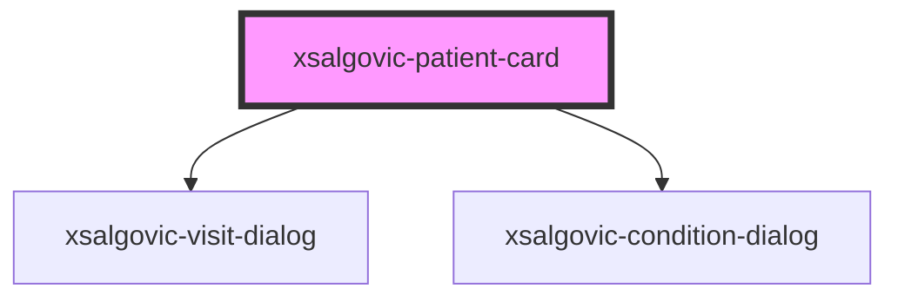

# xsalgovic-patient-card

<!-- Auto Generated Below -->

## Properties

| Property  | Attribute  | Description | Type     | Default     |
| --------- | ---------- | ----------- | -------- | ----------- |
| `apiBase` | `api-base` |             | `string` | `undefined` |

## Dependencies

### Depends on

- [xsalgovic-visit-dialog](../xsalgovic-visit-dialog)
- [xsalgovic-condition-dialog](../xsalgovic-condition-dialog)

### Graph

----------------------------------------------

*Built with [StencilJS](https://stenciljs.com/)*
