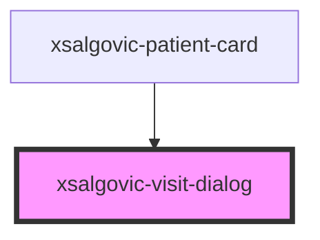

# xsalgovic-visit-dialog

<!-- Auto Generated Below -->

## Properties

| Property     | Attribute     | Description | Type         | Default     |
| ------------ | ------------- | ----------- | ------------ | ----------- |
| `apiBase`    | `api-base`    |             | `string`     | `undefined` |
| `close`      | --            |             | `() => void` | `undefined` |
| `dialogOpen` | `dialog-open` |             | `boolean`    | `undefined` |
| `patient`    | --            |             | `Patient`    | `undefined` |
| `visit`      | --            |             | `Visit`      | `undefined` |

## Events

| Event   | Description | Type               |
| ------- | ----------- | ------------------ |
| `close` |             | `CustomEvent<any>` |

## Dependencies

### Used by

 - [xsalgovic-patient-card](../xsalgovic-patient-card)

### Graph

----------------------------------------------

*Built with [StencilJS](https://stenciljs.com/)*
